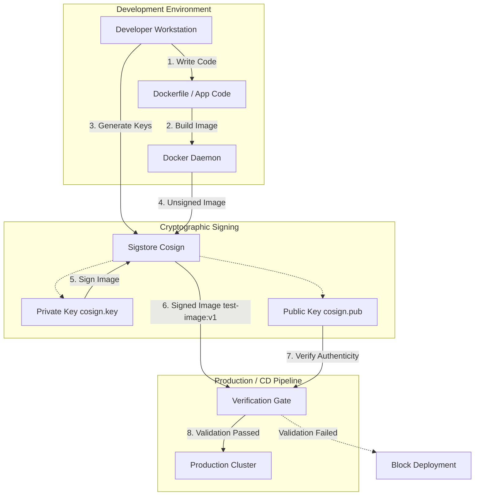

# Lab 08: Securing Your Software Supply Chain

## Aim
To secure the software supply chain by utilizing cryptographic signing to verify that a container image is exactly what was built, hasn't been tampered with, and is safe for production deployment.

---

## Architecture Diagram



---

## Tools Required
* **Docker CLI:** Used to construct the container image from the source Dockerfile.
* **Sigstore Cosign:** An open-source tool to create digital signatures for container images and enforce supply-chain integrity.

---

## Execution Steps

### 1. Keypair Generation
1. Initialize the cryptographic keypair using Cosign:
   ```bash
   cosign generate-key-pair
   ```
2. Securely store the generated `cosign.key` (private) and `cosign.pub` (public) files.

### 2. Container Build and Signing
1. Build the local test container image using Docker:
   ```bash
   docker build -t test-image:v1 .
   ```
2. Sign the built image using the generated private key to establish a digital chain of custody:
   ```bash
   cosign sign --key cosign.key test-image:v1
   ```

### 3. Authenticity Verification
1. Validate the container image using the public key prior to simulated deployment:
   ```bash
   cosign verify --key cosign.pub test-image:v1
   ```
2. Confirm the CLI output states that the signatures were verified against the public key and that the cosign claims are valid.

---

## Screenshots

### 1. Keypair Generation & Image Signing


### 2. Image Verification Success


## Result
* Successfully generated cryptographic keypairs to act as a digital seal for software packages.
* Successfully built and signed a container image, proving its origin and integrity.
* Successfully verified the container image using its public key, demonstrating how to prevent tampered or unapproved images from reaching production environments.
